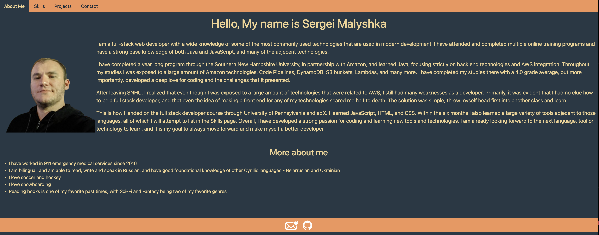

# <My Portfolio>

## Description

A React-made website that has a a short desription about me, all of skills, some of my projects, and ways to contact me

## Table of Contents

- [Installation](#installation)
- [Usage](#usage)
- [Credits](#credits)
- [License](#license)

## Installation

No Installation required

## Usage

Just follow the navbar links to navigate around the website. Live page can be found [Here](https://spiffy-profiterole-5d3af6.netlify.app/)

## Credits

Everything was made by myself, Serg Malyshka. [GitHub profile](https://github.com/SergMalyshka)

## License

